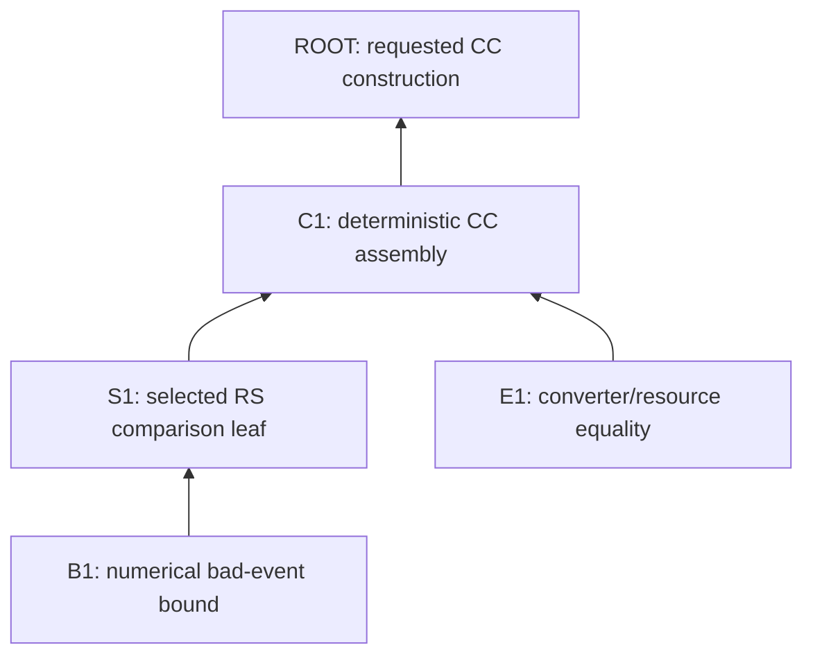

# Temporary proof-obligation DAG

Use this schema only for a nontrivial formalization. Keep it under the
repository's ignored scratch directory or in another disposable location.

Write the functional contract above the graph. The graph itself is rooted at
the exact formal Lean deliverable selected by the current model. If a modeling
revision replaces that root, record why the new root preserves the functional
contract and replace the affected graph rather than merging two models.

## Edge meaning

Write `child --> parent` when the parent consumes the child's exact statement.
Every `PRODUCTION` node created by the task must reach an explicit root.

The graph shows logical consumption, not file imports and not chronological
work order.

## Node table

Keep the Mermaid graph small and store exact statements here:

| ID | Phase | Exact statement or signature | Needed by | Origin | Fate | Status | Evidence |
| --- | --- | --- | --- | --- | --- | --- | --- |
| R | MODEL | requested CC construction | — | NEW | PRODUCTION | OPEN | functional contract and modeling receipt |
| C1 | ROUTE | checked deterministic CC assembly step | R | REUSE | INLINE | OPEN | declaration and signature |
| S1 | ROUTE | exact RS comparison consumed by the CC step | C1 | REUSE | INLINE | OPEN | generated CC leaf |
| B1 | IMPLEMENT | exact remaining numerical inequality | S1 | NEW | PRODUCTION | OPEN | Lean goal after applying the RS endpoint |

Allowed phases:

- `MODEL`: a representation, interface, ownership, or semantic bridge;
- `ROUTE`: a selected mathematical hop or endpoint and its hypotheses;
- `IMPLEMENT`: a proof or definition obligation exposed by the live route; and
- `VERIFY`: a build, axiom, or closure condition needed to release the root.

The phase is classification, not chronology. A failed implementation node can
send the task back to `ROUTE` or `MODEL`.

Allowed origins:

- `REUSE`: a checked existing declaration matches.
- `ADAPT`: an existing declaration has a justified generalization or wrapper.
- `NEW`: searches found no match and the consumer requires a new argument.

Allowed fates:

- `INLINE`: discharge inside its consumer.
- `SCRATCH`: exploratory statement or failed-route probe; never imported by
  production.
- `PRODUCTION`: a stable named declaration that passes the admission gate.

## Expansion rule

Expand only an open node. Its children must come from the exact hypotheses of
the theorem selected for that node, the actual Lean goal, or a displayed
paper-level proof hop. Do not prepopulate likely helper families.

When an apparent child is merely elaboration bookkeeping, keep it inline. When
two children are the same mathematical statement, merge them; when they only
share proof syntax, use proof combinators rather than inventing a theorem.

## Route revision

If the route fails, write the concrete reason next to the affected node, then
replace that branch. Do not retain two live branches merely because work was
invested in the first. Reuse a former node only after giving it a consumer edge
in the new graph.

Preserve potentially useful failed experiments in ignored scratch storage.
Remove task-created production declarations from the abandoned branch after a
usage search and focused rebuild. Never apply this pruning rule to unrelated
pre-existing declarations.

If the failed branch reveals a modeling defect, update the modeling receipt
first. Confirm that the revised formal root still implements the functional
contract, then replace the graph rooted at the obsolete statement.

## Final closure audit

For each declaration added or materially generalized by the diff, answer:

1. Which DAG node is it?
2. Which declaration consumes it?
3. What path reaches a requested root?
4. Why is it production rather than inline or scratch?
5. Did deletion-and-rebuild reject any named definitional or simp-only helper?

Any task-created declaration without satisfactory answers is cleanup work, not
a delivered API.
